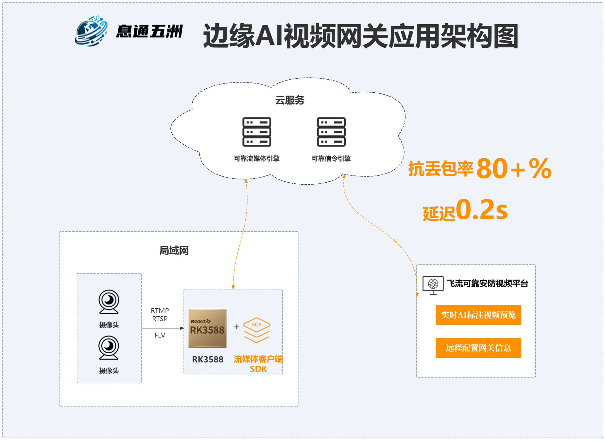

[English](./README.md) | 简体中文

# 飞流边缘AI视频网关
本项目为飞流边缘AI视频网关盒子所部署的相关源程序代码，它适用于应急、安防、无人机巡检等场景下的视频AI识别与实时传输的需求。具备超强的抗弱网特性，完美解决了此类视频远程传输中的卡顿、延迟、花屏等问题,实现了AI标注视频流的超低延迟远程实时播放。为实现智能体的协同提供了一个强有力的通信引擎。本方案是基于RK3588架构实现的。各位开发者可以基于此引擎开发适用于自己应用场景的实时AI视频应用。
# 简介
## 功能介绍
飞流边缘AI视频网关盒子主要解决各类（安防、应急、无人机等）视频远程传输时遇到的卡顿、延迟、花屏，以及缺乏智能等问题。该网关集成了高实时高可靠的自研通讯中间件，实现了 80+%丢包率下的可靠视频传输效果，远程传输时延迟仅为 0.2 秒，远超传统实时视频传输方式（如 RTMP、RTSP、WebRTC 等）。并且结合 RK3588 卓越的 AI 分析能力实现了远程超低延迟的实时 AI 标注视频流的流畅展示。
## 应用架构
 
 RK3588 盒子的主要作用是从局域网中提取视频流，并利用其强大的 AI 分析能力对视频流进行实时标注。随后，借助自主研发的高实时、高可靠通讯中间件，将标注信息及视频流传输至云端。
 ## 特色功能介绍
 **1.远程观看实时视频**
 
 飞流边缘AI视频网关盒子具备高可靠、低延迟的特性，抗丢包能力可达到 80%以上，延迟仅为0.2 秒。
 
 **2.AI 标注结构化**
 
 AI 标注结构化使得远程观看可以实时调整标注内容，以及可以对标注信息进行二次挖掘。
 

| 硬件        | 平台             |操作系统          |
|-----------------|-------------------------|----------------|
| RK3588开发板    | RK3588   | Ubuntu 20    |
| RK3588设备（如浪潮EIS100-RK3588-U)      |  RK3588   | Ubuntu 20   |

# 准备工作
## 硬件准备工作
 1.RK3588 已烧录好 Ubuntu 20.04系统镜像。
 
 2.摄像头为 H264 编码格式，且具备 RTMP/RTSP/FLV 任意一种取流方式。
 
 3.RK3588 与摄像头在同一网段。

 4.RK3588 可以访问公网（互联网）。
 
## 软件准备工作
 1.前往<a href="https://open.zhilianxi.com/front/#/login" target="_blank">息通开发平台</a>注册账号，创建应用获取 APP 鉴权信息；
 
 2.提交设备号。
 可参考<a href="https://github.com/steven-j-on-ai/XtERVGDemo/blob/main/README2.md#%E6%81%AF%E9%80%9A%E5%BC%80%E5%8F%91%E5%B9%B3%E5%8F%B0%E4%BD%BF%E7%94%A8%E6%8C%87%E5%8D%97" target="_blank">息通开发平台使用指南</a>，进行相关操作。
# 试用体验
## 下载 SDK 及 DEMO。
**1.安装及运行。**
```ba
# 解压下载的安装包（下载的安装包名称为随机生成，此处以xt举例，请根据实际情况进行调整）
unzip xt.zip

# 进入项目目录
cd xt

# 修改安装文件的执行权限
chmod +x setup_rk3588.sh

# 以root身份运行
sudo ./setup_rk3588.sh

# 安装完成后，检查monitor进程是否存在。（若不存在，请一分钟后再次查看）
ps -ef | grep -v grep | grep bin/monitor

# monitor日志所在目录
cd /usr/local/xt/logs
```

## 配置通道信息。

此部分可参考[飞流可靠安防视频平台使用指南](https://github.com/steven-j-on-ai/XtERVGDemo/blob/main/README2.md#%E9%A3%9E%E6%B5%81%E5%8F%AF%E9%9D%A0%E5%AE%89%E9%98%B2%E8%A7%86%E9%A2%91%E5%B9%B3%E5%8F%B0%E4%BD%BF%E7%94%A8%E6%8C%87%E5%8D%97)的配置通道部分，进行相关操作。
## 检查通道视频及观看试用。
1.检查通道视频（在RK3588盒子上运行）
```bash
# 检查xftp进程是否存在（若不存在，请一分钟后再次查看）
ps -ef | grep -v grep | grep bin/xftp

# xftp日志所在目录
cd /usr/local/xt/logs
```
2.查看通道视频
此部分可参考[飞流可靠安防视频平台使用指南](https://github.com/steven-j-on-ai/XtERVGDemo/blob/main/README2.md#%E9%A3%9E%E6%B5%81%E5%8F%AF%E9%9D%A0%E5%AE%89%E9%98%B2%E8%A7%86%E9%A2%91%E5%B9%B3%E5%8F%B0%E4%BD%BF%E7%94%A8%E6%8C%87%E5%8D%97)的观看体验部分，进行相关操作。

# 集成SDK开发
## 架构说明

1.用户通过浏览器发送收看视频指令到信令服务器；

2.信令服务器将收看指令转发给RK3588盒子；

3.RK3588盒子在接收到指令后开始拉取摄像头视频流并启动解码推理等线程进行AI推理；

4.RK3588盒子将视频流及推理标签数据推送到流媒体服务器；

5.RK3588盒子将视频流元信息发送至信令服务器；

6.信令服务器将视频流元信息转发至浏览器；

7.浏览器接收到视频流元信息后立即开始从流媒体服务器拉取视频流及推理标签数据以解码及渲染播放。
## 基本原理

**前置条件**：RK3588盒子网关程序（以下简称网关程序）从视频源获取h264数据（当前支持rtsp、rtmp、flv等格式视频流）；
请注意，网关程序存在两条并行的处理逻辑：其一为h264数据的转发过程；其二为视频数据的解码、压缩、推理及标签数据编码传输过程。

1.网关程序接收h264数据并转发（addFrame）至流媒体服务器。

2.视频数据的解码、压缩、推理及标签数据编码传输过程。

（1） 网关程序将接收的h264数据输送至解码器；

（2） 另一线程将解码后的yuv数据输送至RGA；

（3） 输出线程从VPS中读取压缩后的yuv数据，并将其喂入NPU；

（4） 后处理线程从NPU中读取推理结果数据在进行后处理后获得视频标签数据；

（5） 后处理线程将视频标签数据编码（scriptEncoder）后送入SDK（addScript）以实现标签数据的远程可靠传输。
## 源码介绍
1.初始化APP_KEY、APP_SECRET、LICENSE_KEY。
```bash
# 初始化APP_KEY、APP_SECRET、LICENSE_KEY
rt = initAppkeySecretLicense(APP_KEY, APP_SECRET, LICENSE_KEY);
```
2.读取配置信息。
```bash
# 读取配置
int read_config_xtvf(const char *channel_no);
```
3.登录信令服务器。
```bash
# 初始化消息SDK
int start_msg_client(void);
```
4.收到观看视频指令后，在消息回调里初始化连接多媒体服务器。
```bash
# 开启SDK推流
int start_live(void);
```
5.连接多媒体服务器成功后，在成功回调里获取视频流元信息，并将元信息推送给观看端。
```bash
# live SDK推流初始化成功回调
void xftpDidStart(long uidn, long ssrc, const char *remoteFilePath, const char *remoteServerName, int remoteServerPort, int downloadPort);
```
6.获取视频帧的回调函数里将视频帧送入视频解码器，并在其后的线程中将获取的解码数据通过回调函数进行RGA缩放处理，并将将压缩后的视频帧数据送入NPU进行推理操作。详细流程请见下方描述：
```bash
# 启动 RTSP 拉流
int start_pull_video(void)

# 初始化视频帧解码器以及初始化推理模型文件
int init_rk3588(rknn_app_context_t *ctx, const char *model_name, int video_type, int is_rate);

# 设置解码器解码后的回调函数
void mpp_decoder_frame_callback(void *userdata, int width_stride, int height_stride, int width, int height, int format, int fd, void *data);

# 启动线程，将获取的解码数据通过回调函数进行图像压缩、推理等操作
pthread_create(&pid, &attr, get_frame_and_send_script, ctx);
void *get_frame_and_send_script(void *arg);

# 上述线程内调用inference_model, 将解码后的视频帧通过RGA进行尺寸缩放, 并通过rknn进行推理，并获得结果
int inference_model(rknn_app_context_t *app_ctx, image_frame_t *img, detect_result_group_t *detect_result);

# 传输推理标签数据到服务器
void send_script_frame(detect_result_t *results, int count, uint32_t timestamp);

# 将视频帧推送到流媒体服务器
void send_xftp_frame(uint8_t *buffer, int len, uint32_t timestamp);
```
7.停止收看。
```bash
# 关闭多媒体服务器的连接
void stop_session0(uint32_t uidn, uint32_t ssrc);

# 停止RTSP拉流
void stop_rtsp_over_tcp_thread(void);

# 释放解码器，停止回调线程, 停止视频帧压缩以及推理
int deinit_rk3588(rknn_app_context_t *ctx);
```
## 编译源码
1.编译源码。
```bash
# 解压下载的安装包（若“下载并试用”阶段已进行解压，请忽略）
unzip xt.zip

# 进入项目目录
cd xt/src

# 配置APP_KEY、APP_SECRET、LICENSE_KEY（根据开发者应用信息填写）
vi xftp_rk3588.cpp
 #define APP_KEY "应用APP Key"
 #define APP_SECRET "应用APP Secret"
 #define LICENSE_KEY "应用APP License"

# 编译源码并安装
make && make install
```
## 观看试用
登录[飞流可靠安防视频平台](https://monitor.zhilianxi.com/videoMonitorPlatform/index.html#/login)，进行观看试用（应用可用流量有限，请合理规划使用）。
## 附录
xttp消息指令说明。

| 指令类型 | 示例 | 说明 | 参数说明 |
| --- | --- | --- | --- |
| 开启拉流指令 | `type=6;`<br>`control_type=6;` | 拉流端发给推流端，推流端收到后开始向服务器推流，推流成功后给拉流端回“视频流元信息指令”给拉流端。” | `type=6`：表示这是一个控制指令<br>`control_type=6`：表示为开启拉流指令 |
| 视频流元信息指令 | `type=6;`<br>`control_type=2;`<br>`uidn=1234567890;`<br>`ssrc=987654321;`<br>`server_name=r1.wolianxi.com;`<br>`download_port=10961;` | 推流端发送给拉流端，拉流端收到后根据指令内容从服务器进行拉流。 | `type=6`：表示这是一个控制指令<br>`control_type=2`：表示为视频流信息指令<br>`uidn`：文件传输会话标识符1<br>`ssrc`：文件传输会话标识符2<br>`server_name`：流媒体服务器IP或域名<br>`download_port`：流媒体服务器端口号 |
| 关闭拉流指令 | `type=6;`<br>`control_type=3;` | 拉流端发给推流端，推流端收到后结束向服务器推流。 | `type=6`：表示这是一个控制指令<br>`control_type=3`：表示为关闭拉流指令 |
| 询问是否在线指令 | `type=6;`<br>`control_type=5;` | 收到该指令后需回自己的在线状态指令给发送方。 | `type=6`：表示这是一个控制指令<br>`control_type=5`：表示为询问是否在线指令 |
|  在线状态指令 | `type=6;`<br>`control_type=4;`<br>`from=43c50b70203d1d7c6e341bc027a3bc77001;`<br>`is_online=0;` | 收到该指令后，根据指令内容判断对方在线状态 | `type=6`：表示这是一个控制指令<br>`control_type=4`：表示为在线状态指令<br>`from`：对方账号（如果为通道号，即表示该通道的在线状态）<br>`is_online`：在线状态，0表示离线，1表示在线 |
## 联系我们
**如果您在开发过程中遇到问题无法解决可以通过以下方式联系我们**

联系电话：010-64759451

微信二维码:扫码下方二维码后获取进群二维码，再长按识别二维码即可进群。


